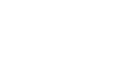

<!--Title Image-->
# 📧 X-Clothing - Html E-mail Template

X-clothing features an HTML email template designed for a fictional store to send promotional content to its customers.  
This project uses archaic inline styles within the HTML, as it's meant to serve as a marketing email template that will be sent via email clients. This ensures better compatibility across different email providers.

Check out the ***Table of Contents*** section to navigate through this documentation.

<!--Menu-->
## :large_orange_diamond: Table of Contents
- [1. Introduction](#large_orange_diamond-introduction)
  - [1.1 Description](#arrow_forward-description)
- [2. Patch Notes](#large_orange_diamond-patch-notes)
  - [2.1 Latest Update](#pushpin-latest-update)
- [3. Features](#large_orange_diamond-features)
  - [3.1 Inline Styling](#arrow_forward-inline-styling)
  - [3.2 Mail Box Display](#arrow_forward-mail-box-display)
  - [3.3 Responsiveness](#arrow_forward-responsiveness)
    - [3.3.1 Mobile](#small_red_triangle_down-mobile)
    - [3.3.2 Tablet](#small_red_triangle_down-tablet)
    - [3.3.3 Desktop](#small_red_triangle_down-desktop)
- [4. Tools and Technologies](#large_orange_diamond-tools-and-technologies) 
  - [4.1 Stacks Used](#arrow_forward-stacks-used)
- [5. Result](#large_orange_diamond-result)
  - [5.1 Deploy](#arrow_forward-deploy)
- [6. Links](#large_orange_diamond-links)
  - [6.1. Project Repository](#arrow_forward-project-repository)
  - [6.2. Social Links](#arrow_forward-social-links)
- [7. Etcetera](#large_orange_diamond-etcetera)
  - [7.1 About](#arrow_forward-about)
  - [7.2 Licenses](#arrow_forward-license)

<!--Introduction-->
## :large_orange_diamond: Introduction
### :arrow_forward: Description

You can check it out how this project is displayed on a mail box by visiting the [3.1 Mail Box Display](#arrow_forward-mail-box-display) section.

<!--Patch Notes-->
## :large_orange_diamond: Patch Notes
### :pushpin: Latest Update
<strong>10/03/2025</strong>
- Project finished.

<!--Features-->
## :large_orange_diamond: Features
### :arrow_forward: Inline Styling
Due to limited CSS support in most email clients, this project uses inline and outdated styling techniques (like the tag `center`, or `cellspacing` to ensure consistent rendering when the email is delivered.  
Check out a few of them: 

+ The use of the `center` tag, and `cellpadding` & `cellspacing` atritbute:

        

            <table style="width: 600px" cellpadding="0" cellspacing="0">
                    <thead>
                        <tr>
                            <th style="padding-top:32px; padding-bottom:12px">
                                
                            </th>
                        </tr>
                    </thead>
                <tbody>

+ The use of `align="center"` in the `td` tag:

                    <tr>
                        <td align="center">
                            

                                <b>USE OUR COUPON FOR A 20% OFF ON YOUR CART:</b>
                            

                            
                                
                                <b draggable="false" style="color: white; font-family: sans-serif;">XCTSUMMER20</b>
                            
                        </td>
                    </tr>

> [!NOTE]  
> In an email template, all images should ideally be stored externally (e.g., on a CDN or image host) and referenced by absolute URLs in the final version. 
> However, in this project all images are hardcoded into the HTML so they can be displayed properly when deployed on Vercel.

### :arrow_forward: Mail Box Display

Here is how the content is displayed in your mail box.

### :arrow_forward: Responsiveness

This E-mail template is designed to fit every device.

#### :small_red_triangle_down: Mobile

- Mobile View

#### :small_red_triangle_down: Tablet

- Tablet View

#### :small_red_triangle_down: Desktop

- Desktop View

<!--Tools Used-->
## :large_orange_diamond: Tools and Technologies
### :arrow_forward: Stacks Used
  

<!--Deploy-->
## :large_orange_diamond: Result

### :arrow_forward: Deploy
* <a href="https://x-clothing-email.vercel.app/" alt="Deploy page">X-Clothing E-mail Sample</a>

<!--Links-->
## :large_orange_diamond: Links
### :arrow_forward: Project Repository
* [X-Clothing E-mail Template GitHub Repository](https://github.com/jeanjusten/XClothing_Email)

### :arrow_forward: Social Links
* [Jean Justen's Github page](https://github.com/jeanjusten)
* [Jean Justen's LinkedIn page](https://www.linkedin.com/in/jeanjusten/)

## :large_orange_diamond: Etcetera
### :arrow_forward: About
X-Clothing E-mail template was created by  <strong>JEAN JUSTEN</strong>.

### :arrow_forward: License
You may use, copy, share and modify the code as you please. No credits needed.

